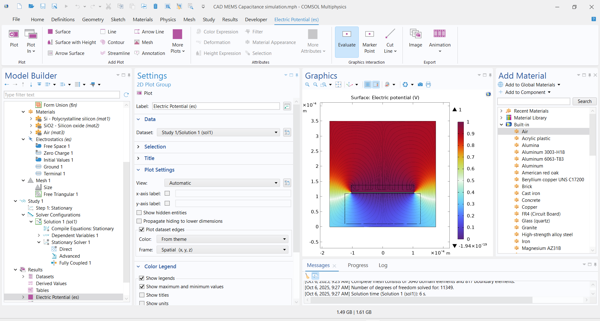
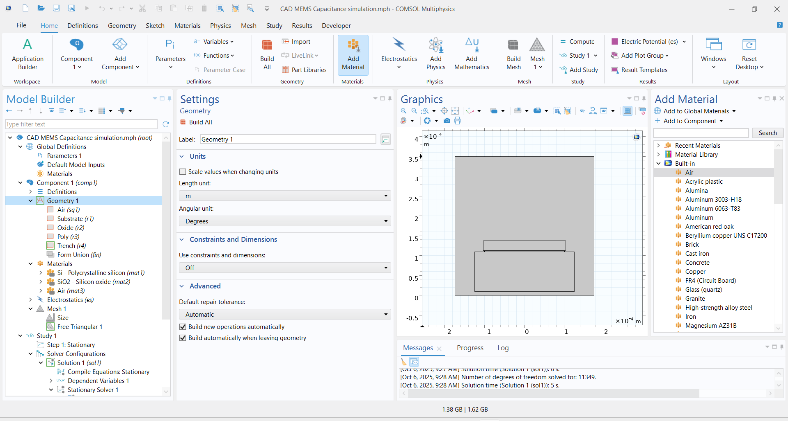

# Lab 01 – Introduction to Electrostatic Actuation

**Course:** MEMS and Microsensors (Master, Polimi)  
**Date of work:** September 2025  
**Author:** Alberto Marrone  
**Reference:** Course Instructor Design

## 📌 Short Summary
* **Objective:** Introduction to multiphysics simulation (Electrostatics) and evaluation of parasitic effects in sensing structures.
* **Simulation:** Analysis of an **in-plane comb-finger capacitor**, focusing on the parallel plate capacitance formed by the comb tip (Cpp).
* **Key Findings:** The simulation quantified the deviation from the ideal linear behavior (dC/dx) due to the fringing fields at the finger tips and the parasitic coupling with the substrate.
* **Method:** Stationary analysis comparing the theoretical parallel plate formula (C = εA/d) against accurate FEM results to evaluate the impact on sensor sensitivity.

## 📂 Included Files
-   `CAD MEMS Capacitance simulation.mph` — COMSOL simulation file.
-   `Images/` — Plots of electric field streamlines and potential distribution.

### Visual Results

## How to reproduce
1.  Open `.mph` file in COMSOL Multiphysics.
2.  Run the **Stationary Study**.
3.  Navigate to "Derived Values" to view the computed global capacitance.

## License
Simulation files: MIT License.
